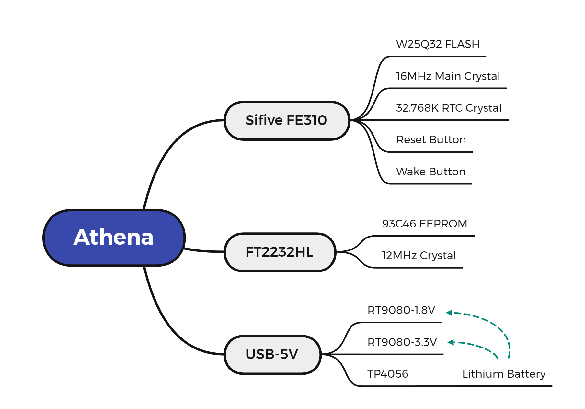

# ELEC594 Capstone Project Athena

🔨This is the repository of Rice University ECE Master's program 2023 Athena capstone project

## Table of Context
[toc]

## Background

Athena is a development board based on Sifive's RISC V microcontroller FE310, which is pin compatible with Click Board([https://www.mikroe.com/click](https://www.mikroe.com/click)) and can be used for undergraduate teaching, experiments.

Currently ELEC220 use TI MSP430 microprocessor for teaching, the future plan is to use Athena Board instead of the original TI MSP430 microprocessor. 

The new Athena Board board has the following points compared to MSP430:

1. Open-source and highly customizable RISC-V instruction set architecture.
2. More powerful 32-bit processing core compared to MSP430's 16-bit core.
3. Dedicated cryptographic co-processor for secure applications.
4. Highly scalable and versatile for a wide range of devices and applications.

## Components List

1. Sifive FE310 Microcontroller
2. FT93C46 EEPROM
3. RT9080 Linear Voltage Regulators (LDO)
4. W25Q64 NOR FLASH
5. FT2232HL Communication Interface Chip

The above are the main chips, please refer to the active BOM for the complete list.

## Schematics Description

Our project is based on HiFive1 Rev B as well as HiFive1 as a reference.

Link to the Sifive board: [https://www.sifive.com/boards](https://www.sifive.com/boards)

Here are the improvements to the Athena board.

- Athena board incorporates a battery management feature that enables it to be powered by either a 4.2V lithium battery or USB-C.
- The Athena board uses the FT2232 with OpenOCD instead of Segger JLINK to download and debug programs at a cheaper cost.
- Athena uses the same FE310-G002 chip as the Hifive1 Rev B, not the FE310-G000 chip of the Hifive1. The two differ mainly in frequency, boot configuration, and AON module voltage. **Therefore the FE310-G000 is not compatible with this design.**
- The Athena board replaces the Micro USB interface with USB-C, an interface that supports both charging, power supply, USB to serial, and JTAG functions.
1. Overall Framework
    
    
    
2. Power Supply
    
    The Sifive FE310-G002 requires two power supply sizes, 3.3V and 1.8V, for powering peripherals and cores respectively. 
    
    The following is the power supply topology diagram.
    
    
    
    - Lithium Battery Management
        
        
        
        The diagram above shows the schematic of this part. We use the TP4056 chip for battery management. The TP4056 is a lithium-ion battery charging IC that utilizes a constant-current/constant-voltage (CC/CV) charging mechanism.
        
        When a battery is connected to the TP4056, the IC begins the charging process by supplying a constant current to the battery. The charging current is set by the value of the external resistor connected to the IC, which is R21 in the schematic above.
        
        Once the battery voltage reaches a certain threshold (typically 4.2V), the TP4056 switches to a constant-voltage charging mode. In this mode, the charging current gradually decreases as the battery approaches full charge, while the voltage remains constant. When the charging current drops to a certain level (typically 1/10 of the set charging current), the TP4056 terminates the charging process and goes into a low-power standby mode.
        
        The LED2 and LED3 is to show the status of the battery charging.
        
    - 3.3V Power Supply
        
        
        
        The diagram above shows the schematic of this part. We use the RT9080-3.3 LDO to convert the 5V from the USB-C input to 3.3V. RT9080 is a low-dropout linear regulator IC that provides a fixed output voltage with a maximum load current of 1.5A. It has a wide input voltage range of 2.5V to 5.5V and a low dropout voltage of 300mV at 1.5A, which helps to reduce power dissipation and increase efficiency. It also includes built-in protection features and is available in a small SOT-223 package.
        
    - 1.8V Power Supply
        
        
        
        The diagram above shows the schematic of this part. We also use the RT9080-1.8 LDO to convert 5V to 1.8V.
        
        Since the PLL part is an analog circuit, which requires higher voltage stability, a πRC filter circuit is used to isolate the PLL supply from the digital part.
        
3. Microcontroller
    
    Athena's main control chip is Sifive FE310-G002, which is mainly composed of RISC V core, peripherals, Always-on, JTAG and other modules. The block diagram is shown below.
    
    
    
    FE310-G002 is a newer version of the FE310 microcontroller and has several improvements over the FE310-G000. Some of the key differences between FE310-G002 and FE310-G000 are:
    
    - Clock speed: FE310-G002 has a higher maximum clock speed of 320 MHz compared to 150 MHz in FE310-G000.
    - Memory: FE310-G002 has more internal RAM and Flash memory than FE310-G000, allowing for more complex applications.
    - Power management: FE310-G002 features improved power management capabilities for better power efficiency and longer battery life compared to FE310-G000.
    - Peripherals: FE310-G002 includes new peripherals, such as an I2S interface and a hardware divider, that were not available in FE310-G000.
    - Security: FE310-G002 includes enhanced security features, such as a physical unclonable function (PUF) for secure key generation and storage, and a secure boot mechanism, which are not present in FE310-G000.
4. FT2232HL
    
    FT2232 is a USB to dual-serial UART (Universal Asynchronous Receiver-Transmitter) converter chip developed by FTDI (Future Technology Devices International) for interfacing USB to various standard serial interfaces.
    
    The FT2232 chip includes two independent UART channels, each with its own set of TX and RX pins. It also supports several other communication interfaces, including I2C, SPI, and JTAG.
    
    FT2232 is commonly used in a variety of applications, including programming and debugging of microcontrollers, FPGA configuration, and general-purpose USB to serial communication.
    
    
    
    Above is its schematic block diagram.
    
    <aside>
    💡 **Note**
    
    FT2232D and FT2232HL are two versions of the FT2232 USB to dual-serial UART converter chip developed by FTDI. While they share many similarities, there are a few key differences between them.
    
    The main difference between FT2232D and FT2232HL is their maximum operating frequency. FT2232D has a maximum operating frequency of 6 MHz, while FT2232HL can operate up to 30 MHz. This means that FT2232HL can support faster data transfer rates compared to FT2232D.
    
    We use the FT2232HL version in our projects. For faster download rates and debugging, use the version with the HL suffix.
    
    </aside>
    

Schematics Description

## Hardware **Deployment**

1. Prerequisites
    - Windows Laptop or Desktop.
        
        Since Altium Designer only supports the Windows operating system, a Windows computer is a necessity.
        
    - Alitum Designer
        
        Altium Designer is a software package that is used for electronic design automation (EDA). It is a powerful tool that helps engineers and designers to create, test, and manufacture electronic circuits and systems. 
        
        Altium Designer is free for university students and licenses can be requested at the following link. [https://www.altium.com/education/student-licenses](https://www.altium.com/education/student-licenses)
        
    - Git
        
        All the files required for the project have been uploaded to Github, so you need to install the Git software.
        
        This is the reference link for Git installation configuration. [https://git-scm.com/book/en/v2/Getting-Started-Installing-Git](https://git-scm.com/book/en/v2/Getting-Started-Installing-Git)
        
2. Clone the repository from Github
    
    Open the Git bash and run following script
    
    ```jsx
    git clone https://github.com/Rice-MECE-Capstone-Projects/Athena.git
    ```
    

## Software **Deployment**

1. Prerequisites
    - SiFive Freedom Studio
        
        Freedom Studio is the fastest way to get started with software development on SiFive RISC-V processors. It is optimized for productivity and usability; your pre/post-silicon and software development teams will have all the tools necessary to write and optimize the best software, identify tough to find hot-spots, and eliminate the toughest bugs with ease. Built on the popular Eclipse IDE, Freedom Studio is packaged with the latest plugins, tools, and viewers, providing software developers crucial insight to the heart of your SoC - the Processor. Get the most performance out of your software running on Simulation Models, FPGA, an Instruction Set Simulator or HiFive Development Boards.
        
        SiFive Freedom Studio is free for everyone and can be downloaded from here. [https://www.sifive.com/software](https://www.sifive.com/software)
        
    - Git
        
        All the files required for the project have been uploaded to Github, so you need to install the Git software.
        
        This is the reference link for Git installation configuration. [https://git-scm.com/book/en/v2/Getting-Started-Installing-Git](https://git-scm.com/book/en/v2/Getting-Started-Installing-Git)
        
2. Clone the repository from Github
    
    Open the Git bash and run following script
    
    ```jsx
    git clone https://github.com/Rice-MECE-Capstone-Projects/Athena.git
    ```