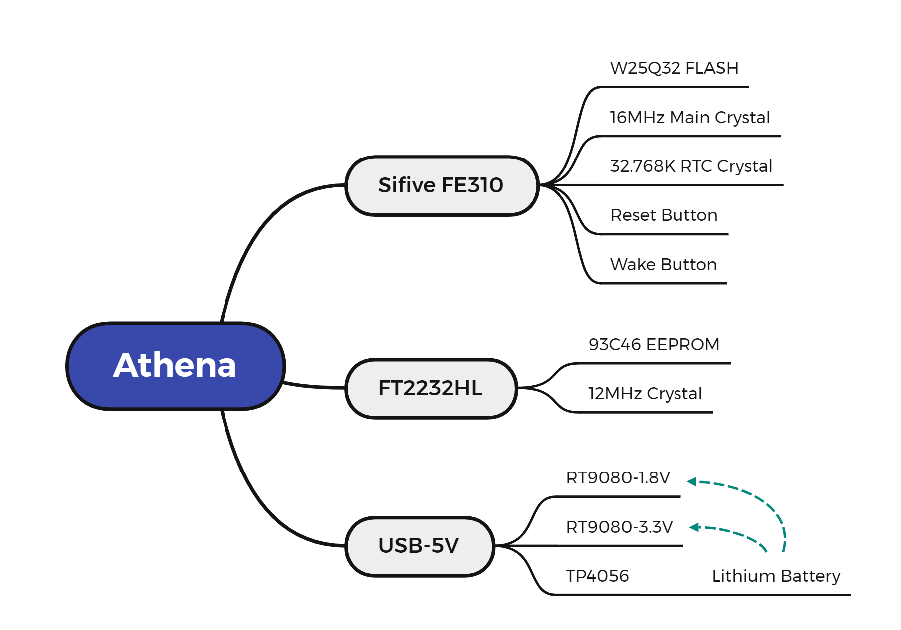

# ELEC594 Capstone Project Athena

🔨This is the repository of Rice University ECE Master's program 2023 Athena capstone project

## Background

Athena is a development board based on Sifive's RISC V microcontroller FE310, which is pin compatible with Click Board([https://www.mikroe.com/click](https://www.mikroe.com/click)) and can be used for undergraduate teaching, experiments.

Currently ELEC220 use TI MSP430 microprocessor for teaching, the future plan is to use Athena Board instead of the original TI MSP430 microprocessor. 

The new Athena Board board has the following points compared to MSP430:

1. Open-source and highly customizable RISC-V instruction set architecture.
2. More powerful 32-bit processing core compared to MSP430's 16-bit core.
3. Dedicated cryptographic co-processor for secure applications.
4. Highly scalable and versatile for a wide range of devices and applications.

## Components List

1. Sifive FE310 Microcontroller
2. FT93C46 EEPROM
3. RT9080 Linear Voltage Regulators (LDO)
4. W25Q64 NOR FLASH
5. FT2232HL Communication Interface Chip

The above are the main chips, please refer to the active BOM for the complete list.

[https://github.com/Rice-MECE-Capstone-Projects/Athena/blob/main/AthenaMain/activeBOM.html](https://github.com/Rice-MECE-Capstone-Projects/Athena/blob/main/AthenaMain/activeBOM.html)

## Schematics Description

Our project is based on HiFive1 Rev B as well as HiFive1 as a reference.

Link to the Sifive board: [https://www.sifive.com/boards](https://www.sifive.com/boards)

Here are the improvements to the Athena board.

- Athena board incorporates a battery management feature that enables it to be powered by either a 4.2V lithium battery or USB-C.
- The Athena board uses the FT2232 with OpenOCD instead of Segger JLINK to download and debug programs at a cheaper cost.
- Athena uses the same FE310-G002 chip as the Hifive1 Rev B, not the FE310-G000 chip of the Hifive1. The two differ mainly in frequency, boot configuration, and AON module voltage. **Therefore the FE310-G000 is not compatible with this design.**
- The Athena board replaces the Micro USB interface with USB-C, an interface that supports both charging, power supply, USB to serial, and JTAG functions.
1. Overall Framework
   
    
    
2. Power Supply
   
    The Sifive FE310-G002 requires two power supply sizes, 3.3V and 1.8V, for powering peripherals and cores respectively. 
    
    
    
    The above diagram describe the power supply topology.
    
    - Power supply switching circuit
      
        The following circuit is used to switch between USB and power supply. 
        
        
        
    - Lithium Battery Management
      
        
        
        The diagram above shows the schematic of this part. We use the TP4056 chip for battery management. The TP4056 is a lithium-ion battery charging IC that utilizes a constant-current/constant-voltage (CC/CV) charging mechanism.
        
        When a battery is connected to the TP4056, the IC begins the charging process by supplying a constant current to the battery. The charging current is set by the value of the external resistor connected to the IC, which is R21 in the schematic above.
        
        Once the battery voltage reaches a certain threshold (typically 4.2V), the TP4056 switches to a constant-voltage charging mode. In this mode, the charging current gradually decreases as the battery approaches full charge, while the voltage remains constant. When the charging current drops to a certain level (typically 1/10 of the set charging current), the TP4056 terminates the charging process and goes into a low-power standby mode.
        
        The LED2 and LED3 is to show the status of the battery charging.
        
    - 3.3V Power Supply
      
        
        
        The diagram above shows the schematic of this part. We use the RT9080-3.3 LDO to convert the 5V from the USB-C input to 3.3V. RT9080 is a low-dropout linear regulator IC that provides a fixed output voltage with a maximum load current of 1.5A. It has a wide input voltage range of 2.5V to 5.5V and a low dropout voltage of 300mV at 1.5A, which helps to reduce power dissipation and increase efficiency. It also includes built-in protection features and is available in a small SOT-223 package.
        
    - 1.8V Power Supply
      
        
        
        The diagram above shows the schematic of this part. We also use the RT9080-1.8 LDO to convert 5V to 1.8V.
        
        Since the PLL part is an analog circuit, which requires higher voltage stability, a πRC filter circuit is used to isolate the PLL supply from the digital part.
    
3. Microcontroller
   
    Athena's main control chip is Sifive FE310-G002, which is mainly composed of RISC V core, peripherals, Always-on, JTAG and other modules. The block diagram is shown below.
    
    
    
    FE310-G002 is a newer version of the FE310 microcontroller and has several improvements over the FE310-G000. Some of the key differences between FE310-G002 and FE310-G000 are:
    
    - Clock speed: FE310-G002 has a higher maximum clock speed of 320 MHz compared to 150 MHz in FE310-G000.
    - Memory: FE310-G002 has more internal RAM and Flash memory than FE310-G000, allowing for more complex applications.
    - Power management: FE310-G002 features improved power management capabilities for better power efficiency and longer battery life compared to FE310-G000.
    - Peripherals: FE310-G002 includes new peripherals, such as an I2S interface and a hardware divider, that were not available in FE310-G000.
    - Security: FE310-G002 includes enhanced security features, such as a physical unclonable function (PUF) for secure key generation and storage, and a secure boot mechanism, which are not present in FE310-G000.
4. FT2232HL
   
    FT2232 is a USB to dual-serial UART (Universal Asynchronous Receiver-Transmitter) converter chip developed by FTDI (Future Technology Devices International) for interfacing USB to various standard serial interfaces.
    
    The FT2232 chip includes two independent UART channels, each with its own set of TX and RX pins. It also supports several other communication interfaces, including I2C, SPI, and JTAG.
    
    FT2232 is commonly used in a variety of applications, including programming and debugging of microcontrollers, FPGA configuration, and general-purpose USB to serial communication.
    
    
    
    Above is its schematic block diagram.
    
    🖋️Note:
    
    
    FT2232D and FT2232HL are two versions of the FT2232 USB to dual-serial UART converter chip developed by FTDI. While they share many similarities, there are a few key differences between them.
    
    The main difference between FT2232D and FT2232HL is their maximum operating frequency. FT2232D has a maximum operating frequency of 6 MHz, while FT2232HL can operate up to 30 MHz. This means that FT2232HL can support faster data transfer rates compared to FT2232D.
    
    We use the FT2232HL version in our projects. For faster download rates and debugging, use the version with the HL suffix.
    

## Hardware **Deployment**

1. Prerequisites
    - Windows Laptop or Desktop.
      
        Since Altium Designer only supports the Windows operating system, a Windows computer is a necessity.
        
    - Alitum Designer
      
        Altium Designer is a software package that is used for electronic design automation (EDA). It is a powerful tool that helps engineers and designers to create, test, and manufacture electronic circuits and systems. 
        
        Altium Designer is free for university students and licenses can be requested at the following link. [https://www.altium.com/education/student-licenses](https://www.altium.com/education/student-licenses)
        
    - Git
      
        All the files required for the project have been uploaded to Github, so you need to install the Git software.
        
        This is the reference link for Git installation configuration. [https://git-scm.com/book/en/v2/Getting-Started-Installing-Git](https://git-scm.com/book/en/v2/Getting-Started-Installing-Git)
    
2. Clone the repository from Github
   
    Open the Git bash and run following script
    
    ```jsx
    git clone https://github.com/Rice-MECE-Capstone-Projects/Athena.git
    ```
    
3. Enter the project catalogue
   
    ```jsx
    cd Athena/AthenaMain
    ls
    ```
    
    
    
    The .PrjPcb files is the project file entry.
    
    Open .PrjPcb to view PCBs and schematics etc. in the Projects directory.
    
4. View the design
    - The 2-D PCB
      
        
        
    - The 3-D PCB preview
      
        
    
5. Creating an interactive BOM
   
    InteractiveHtmlBom is an open-source tool that converts BOM (Bill of Materials) data from PCB design software into an interactive HTML document. This tool helps electronics engineers to easily check their PCB design and confirm the required components more conveniently.
    
    InteractiveHtmlBom supports multiple PCB design software, including KiCad, Altium, Eagle, and OrCAD, among others. Users can extract BOM data from these software using a Python script and convert it into an interactive HTML document. InteractiveHtmlBom also provides some customization options so that users can adjust the appearance and behavior of the output document.
    
    Below is the Github repository for the interactive BOM table.
    
    [https://github.com/lianlian33/InteractiveHtmlBomForAD](https://github.com/lianlian33/InteractiveHtmlBomForAD)
    
    The original repository version is as follows.
    
    [https://github.com/openscopeproject/InteractiveHtmlBom](https://github.com/openscopeproject/InteractiveHtmlBom)
    
6. Send factory for manufacturing
   
    We use JLCPCB for manufacturing, and it takes about a week to get the finished product.
    
    
    
    
    

## PCB Description

1. Rules of layout
   
    PCB layout rules are a set of design guidelines that ensure the successful operation of a printed circuit board. They specify the minimum clearances, trace widths, and other parameters required to meet the electrical, mechanical, and thermal requirements of the circuit design. Adhering to these rules is essential to avoid issues such as signal interference, electrical shorts, thermal problems, and mechanical failures. Non-compliance can result in increased manufacturing costs and delays. By following the PCB layout rules, designers can ensure that their boards meet the required specifications, operate correctly, and can be manufactured efficiently and cost-effectively, ultimately leading to a better end product.
    
    Athena boards are prototyped at JLCPCB and therefore the design rules need to meet the process requirements of the JLCPCB factory.
    
    The Athena boards use 4-layer boards and are prototyped at JLCPCB, so the design rules need to meet the process requirements for 4-layer boards at the JLCPCB factory.
    
    The JLCPCB factory process rules are as follows. If using other manufacturers for proofing, be sure to check that the design meets their rules.
    
    [https://jlcpcb.com/capabilities/pcb-capabilities](https://jlcpcb.com/capabilities/pcb-capabilities)
    
    - Clearance
      
        The significance of the Clearance rule is to avoid unnecessary electrical interaction between components or between components and traces, thereby maintaining the signal integrity of the circuit board. This can significantly reduce the possibility of noise and other signal problems, ensure the normal operation of the circuit board, and improve the stability and reliability of the circuit board.
        
        
        
    - Width
      
        The significance of the Width rule is to ensure that the correct amount of current can flow through the trace without causing any damage to the board or components. Inadequate trace widths can lead to overheating, voltage drops, and even electrical shorts, which can cause the board to fail or malfunction. Following the Width rule can also help to optimize the performance of the circuit board, by minimizing signal degradation and interference.
        
        
        
    - PlaneConnect
      
        PlaneConnect is a feature in PCB design software that allows designers to connect different areas of copper planes on a printed circuit board. There are several ways to connect these areas, each with its own advantages and disadvantages. The most common of these are direct connection and thermal relief connection.
        
        1. Thermal Relief Connection: This method involves using a small trace or pad to connect the plane to a component lead. The advantage of this method is that it provides a thermal break between the plane and the component, which can help prevent soldering problems. However, it can also create a weak connection and increase the resistance in the plane.
        2. Direct Connection: This method involves connecting the plane directly to a pad or via on the board. The advantage of this method is that it provides a strong connection and reduces the resistance in the plane. However, it can also create a thermal problem if the plane is connected directly to a high-power component.
        
        
        
    - PolygonConnect
      
        
    
2. Placement and Wiring Notes
    - Crystals
      
        In PCB design, there are several points to consider when laying out and routing passive crystal oscillators:
        
        1. Placement: The crystal oscillator should be placed as close to the chip as possible, with short connection lines to minimize signal attenuation and noise interference. Additionally, the oscillator should be located away from other high-frequency interference sources such as power and clock signals.
        2. Grounding: A solid and adequate ground connection for the oscillator is essential to ensure signal stability and reliability. The grounding area should be as large as possible, and the distance between the oscillator and the ground should be minimized. The oscillator grounding should be separated from other signal grounds to reduce interference.
        3. Routing: The oscillator routing should be as short as possible, and impedance matching should be used to avoid signal reflection and interference. Additionally, the oscillator routing should avoid being near high-frequency interference sources such as power lines and clock signals.
        
        In our Athena board, we put the crystal oscillator in the center of the board and as close to the chip as possible, and there is no trace under the crystal oscillator. This improves the stability of the board.
        
        - 16MHz Passive crystal oscillator
          
            
            
        - 12MHz Passive crystal oscillator
          
            
            
        - 32.768KHz RTC Passive crystal oscillator
          
            
            

## Soldering Advice

1. Solder the power supply first, and test whether the 3.3V and 1.8V outputs are normal.
2. Solder the FT2232 chip and its peripheral devices.
   
    [https://www.notion.so](https://www.notion.so)
    
3. Test the FT2232 function, when the USB is plugged into the computer, two new devices will be seen in the device manager.
4. After installing the driver in Freedom Studio, the device can be found in the debugger option.
   
    
    
5. Soldering Sifive FE310 (have not done)

## Software **Deployment**

1. Prerequisites
    - SiFive Freedom Studio
      
        Freedom Studio is the fastest way to get started with software development on SiFive RISC-V processors. It is optimized for productivity and usability; your pre/post-silicon and software development teams will have all the tools necessary to write and optimize the best software, identify tough to find hot-spots, and eliminate the toughest bugs with ease. Built on the popular Eclipse IDE, Freedom Studio is packaged with the latest plugins, tools, and viewers, providing software developers crucial insight to the heart of your SoC - the Processor. Get the most performance out of your software running on Simulation Models, FPGA, an Instruction Set Simulator or HiFive Development Boards.
        
        SiFive Freedom Studio is free for everyone and can be downloaded from here. [https://www.sifive.com/software](https://www.sifive.com/software)
        
    - Git
      
        All the files required for the project have been uploaded to Github, so you need to install the Git software.
        
        This is the reference link for Git installation configuration. [https://git-scm.com/book/en/v2/Getting-Started-Installing-Git](https://git-scm.com/book/en/v2/Getting-Started-Installing-Git)
    
2. Clone the repository from Github
   
    Open the Git bash and run following script
    
    ```jsx
    git clone https://github.com/Rice-MECE-Capstone-Projects/Athena.git
    ```
    
3. When we finish the PCB soldering and pass the hardware test then we will continue to develop the firmware/software part.

updated 4/26